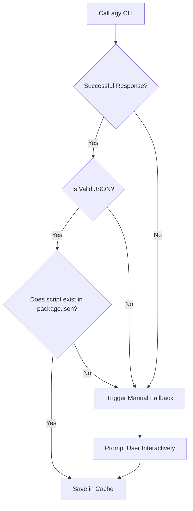

# Prompt Specification for Compilation Inference (Agy)

This document defines the technical specification and design of the prompts that NodePi sends to the AI service (`agy`) to analyze the compilation structure of local dependencies. The goal is to maximize accuracy, prevent hallucinations, and guarantee structured responses in valid JSON format.

---

## 🏗️ Optimized Prompt Structure

The prompt is split into three clear sections using semantic delimiters (XML-style tags):

1. **System Instructions**: Establishes the expert role, resolution rules, and inference priorities.
2. **Context Data**: Provides structured target project details (`package.json`, `tsconfig*.json`, bundler configurations).
3. **Response Schema**: Forces a strict JSON output without introductory text or additional explanations.

---

## 1. Inference Instructions (System Prompt)

The prompt instructs the AI to behave as an expert Node.js build system analyzer and follow these step-by-step inference guidelines:

### Script Inference Rules

1. **`buildScript` (Build Script)**:
   - Must search `"scripts"` in `package.json` for names like: `build`, `compile`, `dist`, `prod`, `build:prod`.
   - Prioritizes commands that transpile or package code. If the script runs tests, linters, or dev servers, it must **not** be selected.
   - If no viable build script is detected, returns `null`.
2. **`watchScript` (Watch Script)**:
   - Must search for scripts that compile with the `--watch` or `-w` flag, or are named `watch`, `dev:watch`, `build:watch`, `compile:watch`.
   - **Critical Exclusion**: Avoid live server scripts like `dev`, `start`, or `serve` if their main function is to spin up a local HTTP/dev server (e.g., `vite` or `next dev`), unless they also exclusively recompile library code.
   - If no library-specific watch script exists, returns `null`.
3. **`outDir` (Output Directory)**:
   - **Source 1 (TSConfig)**: Checks `tsconfig*.json` (prioritizing `.build.json` over `.json`). Extracts `compilerOptions.outDir`.
   - **Source 2 (Bundler Config)**: Checks bundler configurations:
     - Vite: `build.outDir` (default: `dist`).
     - Webpack: `output.path` or `output.dir` (default: `dist` or `build`).
     - Rollup: `output.file` or `output.dir` (e.g., if `output.file` is `dist/index.js`, the outDir is `dist`).
   - **Source 3 (Entrypoints)**: Checks `main`, `module`, or `exports` fields in `package.json`. If they point to `dist/index.js` or `lib/index.js`, the outDir is `dist` or `lib`.
   - If the project has no compilation (e.g., vanilla JS), returns `.` or `""`.

---

## 2. In-Code Prompt Template

The dynamically generated prompt by NodePi is structured as follows:

> **Implementation Note**: The `{{variable}}` and `{{#if}}` / `{{#each}}` syntax is illustrative pseudocode. The real implementation uses ES6 template literals (`${variable}`) and native JavaScript loops to construct the prompt string.

```markdown
You are an expert package configuration and build analyzer for JavaScript/TypeScript. Your goal is to deduce the optimal build command (`buildScript`), watch/live compile command (`watchScript`), and final output directory (`outDir`) for a local dependency based exclusively on its configuration files.

Strictly follow this internal reasoning:

1. Scan the package.json scripts to detect compilation/build tasks (avoid web dev servers).
2. Determine the "outDir" by cross-referencing tsconfig files, webpack/vite configs, and the package.json "main"/"module" fields.
3. If the build script uses TypeScript but there is no explicit watch script, return null for "watchScript" (NodePi will handle native fallback with tsc).

---

PACKAGE DATA: Name: {{packageName}}

<package_json> {{packageJsonContent}} </package_json>

{{#if tsconfigs}} <typescript_configurations> {{#each tsconfigs}} File: {{this.fileName}} Content: {{this.content}}

---

{{/each}} </typescript_configurations> {{/if}}

{{#if bundlerConfigs}} <bundler_configurations> {{#each bundlerConfigs}} File: {{this.fileName}} Content: {{this.content}}

---

{{/each}} </bundler_configurations> {{/if}}

---

Respond ONLY with a JSON code block enclosed in triple backticks (`json ... `) with the following structure:

```json
{
  "buildScript": "script_name_or_null",
  "watchScript": "script_name_or_null",
  "outDir": "relative_path_to_output_directory"
}
```
```

Do not add any explanatory text before or after the JSON block.

---

## 2.1 Agy Invocation Command

NodePi invokes `agy` as a non-interactive subprocess using `execa`:

```bash
agy --print "<generated_prompt>" --print-timeout 45s --dangerously-skip-permissions
```

- `--print`: Non-interactive mode. Runs the prompt and returns the response via stdout.
- `--print-timeout 45s`: 45-second timeout. If the AI doesn't respond in time, NodePi triggers the manual fallback.
- `--dangerously-skip-permissions`: Prevents interactive permission prompts that would block the subprocess.

NodePi parses the stdout output looking for a JSON code block (` ```json ... ``` `) using a regular expression.

---

## 3. Fallbacks and AI Error Handling

To ensure NodePi never fails due to a badly processed prompt or network error, a response quality control pipeline is implemented:



### Hallucination Guard Rules

NodePi validates the AI response against the dependency's original `package.json`:

1. If `buildScript` is not `null`, it must exactly match one of the keys of the `"scripts"` object in the `package.json`. If it doesn't match, it is invalidated and assumed to be `null`.
2. If `watchScript` is not `null`, it must exactly match one of the keys of the `"scripts"` object. If it doesn't match, it is invalidated and assumed to be `null`.
3. If `outDir` is not a valid physical path within the project (or referenced in tsconfigs/package.json), it is defaulted to `"dist"` if the folder exists physically, or the user is prompted.

### Dependencies Without Compilation (Pure JavaScript)

If the AI (or the user in fallback mode) determines that a dependency does not require compilation (has no build or watch script, and does not use TypeScript), NodePi will:

1. Return `buildScript: null`, `watchScript: null`, and `outDir: "."` (project root).
2. In Sync mode, NodePi will sync the package source files directly without running any background compiler.
