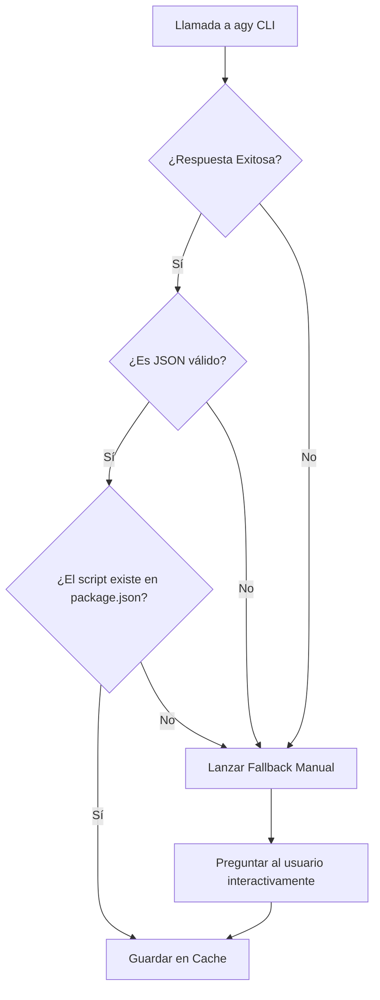

# Especificación de Prompts para Inferencia de Compilación (Agy)

Este documento define la especificación técnica y el diseño de los prompts que NodePi envía al servicio de IA (`agy`) para analizar la estructura de compilación de las dependencias locales. El objetivo es maximizar la precisión, evitar alucinaciones y garantizar respuestas estructuradas en formato JSON válido.

---

## 🏗️ Estructura del Prompt Optimizado

El prompt se divide en tres secciones claras utilizando delimitadores semánticos (XML-style tags):

1. **System Instructions (Instrucciones del Sistema)**: Establece el rol de experto, las reglas de resolución y las prioridades de inferencia.
2. **Context Data (Datos de Contexto)**: Proporciona la información estructurada del proyecto a analizar (`package.json`, `tsconfig*.json`, configuraciones de bundlers).
3. **Response Schema (Esquema de Respuesta)**: Fuerza una salida JSON estricta sin texto introductorio ni explicaciones adicionales.

---

## 1. Instrucciones de Inferencia (System Prompt)

El prompt instruye a la IA a comportarse como un analizador experto de sistemas de construcción de Node.js y seguir estas directrices de inferencia paso a paso:

### Reglas de Inferencia de Scripts

1. **`buildScript` (Script de Construcción)**:
   - Debe buscar en `"scripts"` de `package.json` por nombres como: `build`, `compile`, `dist`, `prod`, `build:prod`.
   - Prioriza comandos que transpilen o empaqueten código. Si el script ejecuta tests, linters o servidores dev, **no** debe seleccionarse.
   - Si no se detecta ningún script de construcción viable, retorna `null`.
2. **`watchScript` (Script de Observación)**:
   - Debe buscar scripts que compilen con la bandera `--watch`, `-w` o que se llamen `watch`, `dev:watch`, `build:watch`, `compile:watch`.
   - **Exclusión Crítica**: Evita scripts de servidor en vivo como `dev`, `start` o `serve` si su función principal es levantar un servidor HTTP/dev-server local (ej. `vite` o `next dev`), a menos que también se encarguen únicamente de recompilar código de librería.
   - Si no existe un script de watch específico para la librería, retorna `null`.
3. **`outDir` (Directorio de Salida)**:
   - **Fuente 1 (TSConfig)**: Revisa `tsconfig*.json` (priorizando `.build.json` sobre `.json`). Extrae `compilerOptions.outDir`.
   - **Fuente 2 (Bundler Config)**: Revisa configuraciones de bundlers:
     - Vite: `build.outDir` (default: `dist`).
     - Webpack: `output.path` o `output.dir` (default: `dist` o `build`).
     - Rollup: `output.file` o `output.dir` (ej: si `output.file` es `dist/index.js`, el outDir es `dist`).
   - **Fuente 3 (Entrypoints)**: Revisa campos `main`, `module` o `exports` de `package.json`. Si apuntan a `dist/index.js` o `lib/index.js`, el outDir es `dist` o `lib`.
   - Si el proyecto no tiene compilación (ej. JS vanilla), retorna `.` o `""`.

---

## 2. Plantilla del Prompt en Código (Template)

El prompt generado dinámicamente por NodePi se estructura de la siguiente manera:

> **Nota de implementación**: La sintaxis `{{variable}}` y `{{#if}}` / `{{#each}}` es pseudocódigo ilustrativo. En la implementación real se usarán template literals de ES6 (`${variable}`) y bucles nativos de JavaScript para construir el string del prompt.

````markdown
Eres un analizador de configuraciones de empaquetado y compilación de JavaScript/TypeScript. Tu objetivo es deducir los comandos óptimos de construcción (`buildScript`), observación en vivo (`watchScript`) y el directorio final de salida (`outDir`) para una dependencia local basándote exclusivamente en sus archivos de configuración.

Sigue este razonamiento interno de forma estricta:

1. Revisa los scripts del package.json para detectar tareas de compilación (evita servidores web).
2. Determina el "outDir" cruzando los archivos tsconfig, configuraciones de webpack/vite y los campos "main"/"module" del package.json.
3. Si el script de compilación usa TypeScript pero no hay un script "watch" explícito, devuelve null en "watchScript" (NodePi se encargará del fallback nativo con tsc).

---

DATOS DEL PAQUETE: Nombre: {{packageName}}

<package_json> {{packageJsonContent}} </package_json>

{{#if tsconfigs}} <typescript_configurations> {{#each tsconfigs}} Archivo: {{this.fileName}} Contenido: {{this.content}}

---

{{/each}} </typescript_configurations> {{/if}}

{{#if bundlerConfigs}} <bundler_configurations> {{#each bundlerConfigs}} Archivo: {{this.fileName}} Contenido: {{this.content}}

---

{{/each}} </bundler_configurations> {{/if}}

---

Responde ÚNICAMENTE con un bloque de código JSON encerrado en triples comillas invertidas (`json ... `) con la siguiente estructura:

```json
{
  "buildScript": "nombre_del_script_o_null",
  "watchScript": "nombre_del_script_o_null",
  "outDir": "ruta_relativa_al_directorio_de_salida"
}
```
````

No agregues texto explicativo ni antes ni después del bloque de código JSON.

````

## 2.1 Comando de Invocación de Agy

NodePi invoca `agy` como subproceso no interactivo usando `execa`:

```bash
agy --print "<prompt_generado>" --print-timeout 5s --dangerously-skip-permissions
````

- `--print`: Modo no interactivo. Ejecuta el prompt y devuelve la respuesta por stdout.
- `--print-timeout 5s`: Timeout de 5 segundos. Si la IA no responde a tiempo, NodePi activa el fallback manual.
- `--dangerously-skip-permissions`: Evita prompts interactivos de permisos que bloquearían el subproceso.

NodePi parsea la salida de stdout buscando un bloque de código JSON (` ```json ... ``` `) mediante una expresión regular.

---

## 3. Manejo de Fallbacks y Errores de la IA

Para asegurar que NodePi nunca falle por un prompt mal procesado o un fallo de red, se implementa una tubería de control de calidad de la respuesta:



### Reglas del Guardián de Alucinaciones (Hallucination Guard)

NodePi validará la respuesta de la IA contra el `package.json` original de la dependencia:

1. Si `buildScript` no es `null`, debe coincidir exactamente con una de las llaves del objeto `"scripts"` en el `package.json`. Si no coincide, se invalida y se asume `null`.
2. Si `watchScript` no es `null`, debe coincidir exactamente con una de las llaves del objeto `"scripts"`. Si no coincide, se invalida y se asume `null`.
3. Si `outDir` no es una ruta física válida dentro del proyecto (o no está referenciada en tsconfigs/package.json), se le asigna `"dist"` como valor predeterminado si existe la carpeta físicamente, o se le pregunta al usuario.

### Dependencias sin Compilación (JavaScript Puro)

Si la IA (o el usuario en modo fallback) determina que una dependencia no requiere compilación (no tiene script de build ni de watch viable, y no tiene TypeScript), NodePi debe:

1. Devolver `buildScript: null`, `watchScript: null`, y `outDir: "."` (raíz del proyecto).
2. En modo Sync, NodePi sincronizará directamente los archivos fuente del paquete sin lanzar ningún compilador en segundo plano.
