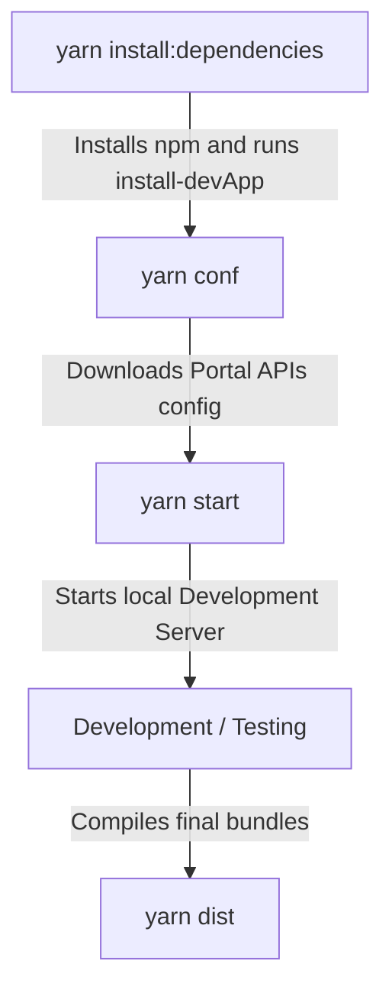

# Comprehensive Case Documentation: Local Development and Bundling (RP10)

This document details in an exhaustive manner the behavior of the isolated development and bundling environment used by RedPoints RP10 modules, based on the interaction between [redpoints-front-documents-rp10](file:///Users/jorge/projects/frontend-repos/redpoints-front-documents-rp10) and [redpoints-front-bundle-interface-rp10](file:///Users/jorge/projects/frontend-repos/redpoints-front-bundle-interface-rp10).

---

## 1. Architectural Context

RP10 front-end modules (such as `documents-rp10`) are designed to be fully modular and developed in isolation. To avoid infrastructure code duplication (compilation setups, linters, containers, and the shell that simulates the production Portal), a **Centralized Development Shell** approach is used.

The infrastructure repository [redpoints-front-bundle-interface-rp10](file:///Users/jorge/projects/frontend-repos/redpoints-front-bundle-interface-rp10) acts as the provider of development templates and the compilation engine.

---

## 2. Initialization Flow: `install-devApp`

When the developer runs `yarn install-devApp` (usually invoked automatically as part of the preparation phase when installing dependencies in [package.json](file:///Users/jorge/projects/frontend-repos/redpoints-front-documents-rp10/package.json#L119)), the TypeScript binary [install-devApp.ts](file:///Users/jorge/projects/frontend-repos/redpoints-front-bundle-interface-rp10/src/bin/install-devApp.ts) is executed.

### Key processes of `install-devApp`:

1. **Signature Validation**: The script verifies that application-specific configuration files exist (`src/devAppConfig/constants`, `routes`, `reducers`, `menuConfig`) in the target repository.
2. **File Synchronization**: Removes obsolete copies and copies the master templates from `node_modules/redpoints-front-bundle-interface-rp10/devAppRoot/` to the root of the working repository. This includes `index.html`, `vite.config.ts`, `.eslintrc`, `.prettierrc`, jest configurations, docker files, etc.
3. **Token Substitution (Name Injection)**: Searches for the template placeholder `{bundle-name-to-inject}` and replaces it with the actual module name (in this case, `redpoints-front-documents-rp10`).
   - **Vite Aliases**: This creates an alias mapping in `vite.helpers.js`:
     ```javascript
     {
       find: /^redpoints-front-documents-rp10/,
       replacement: path.resolve(__dirname, 'src/modules/'),
     }
     ```
     Thanks to this, the source code can import its own submodules simulating npm imports of the real package.
4. **Git Protection (.gitignore)**: Dynamically inserts the physical paths of all copied files into the local `.gitignore` file, surrounded by the `#<<<InjectedFromBundleInterfaceRp10>>>` tags. This prevents uploading environment temporary files to the Git history.

---

## 3. Execution Guide: Scripts Sequence

To work in the repository, the recommended script sequence is organized as follows:



### A. Environment Preparation

- **`yarn install:dependencies`**: Installs local packages and runs `install-devApp` sequentially.
- **`yarn conf`** (or **`yarn conf:pre`**): Responsible for downloading and syncing the JSON configuration containing external service URLs and saving it to `public/config/config.json`. Without this file, the local Portal will not know how to communicate with development or pre-production backend APIs.

### B. Development Cycle

- **`yarn start`** (or **`yarn start:pre`**): Starts the local Vite development server, spinning up the corresponding domain (e.g., `https://portal.ipr.dev.redpoints.com:8000`).
- **`yarn test`**: Runs the suite of unit tests configured at the root via the compiler and the copied jest adapter.

### C. Compiling for Production (Distribution)

- **`yarn dist`**: Cleans the `./dist` folder and executes the packaging logic described in [vite-build-bundle.js](file:///Users/jorge/projects/frontend-repos/redpoints-front-bundle-interface-rp10/src/devAppRoot/vite-build-bundle.js):
  - **Batch Compilation**: Vite builds each bundle configured in `vite-build-bundle.config.json` sequentially.
  - **Access to External Dependencies**: Third-party dependency packages and dependencies prefixed with `redpoints-` are excluded via Rollup to avoid duplicate bundles.
  - **Redux Action Types Prefix Injection**: Through the post-compilation hook, it analyzes and rewrites action strings to add the prefix (e.g. `DOCUMENTS_REPOSITORY@CLEAR`), avoiding scope conflicts in the global store.
  - **Building and Packaging**: The `package.json` is copied to `./dist` and `yarn pack` is executed inside `./dist` to flatten the resulting package.

---

## 4. Automation with Intelligent Agent (`agy`)

To allow the Antigravity agent (`agy`) to automatically determine and validate this entire sequence in any RP10 repository without prior knowledge, the following detailed instruction is defined:

### Proposed Prompt for `agy`:

> "Analyze the [package.json](file:///Users/jorge/projects/frontend-repos/redpoints-front-documents-rp10/package.json) file of the target repository and the tools provided by [redpoints-front-bundle-interface-rp10](file:///Users/jorge/projects/frontend-repos/redpoints-front-bundle-interface-rp10).
>
> Calculate and detail the exact sequence of terminal commands (scripts) that must be run in order to:
>
> 1. Configure and download the project's remote dependencies.
> 2. Initialize the isolated local development environment using `install-devApp` (explaining which files it copies and what aliases it configures).
> 3. Download the configuration file for the test environment (`conf`).
> 4. Start the local Vite server.
> 5. Build and package the final bundle for production (`dist`), explaining the process of automatic action prefix injection in Redux to prevent collisions in the global Portal.
>
> For each listed command, specify what subprocess or binary it executes, whether it alters any file controlled by Git, and how it cleans up temporary artifacts."
