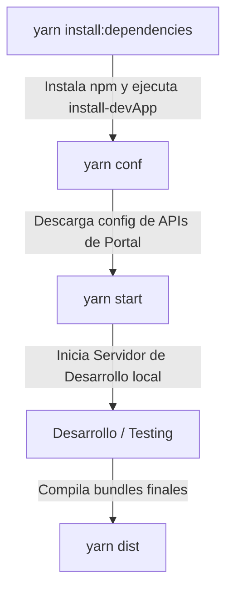

# Documentación Completa del Caso: Desarrollo Local y Bundling (RP10)

Este documento detalla de manera exhaustiva el funcionamiento del entorno de desarrollo aislado y compilación (bundling) utilizado por los módulos de RedPoints RP10, tomando como base la interacción entre [redpoints-front-documents-rp10](file:///Users/jorge/projects/frontend-repos/redpoints-front-documents-rp10) y [redpoints-front-bundle-interface-rp10](file:///Users/jorge/projects/frontend-repos/redpoints-front-bundle-interface-rp10).

---

## 1. Contexto Arquitectónico

Los módulos front-end de RP10 (como `documents-rp10`) están diseñados para ser totalmente modulares y desarrollados en aislamiento. Para evitar la duplicación de código de infraestructura (configuraciones de compilación, linters, contenedores y el cascarón que simula el Portal de producción), se utiliza un enfoque de **Cascarón de Desarrollo Centralizado**.

El repositorio de infraestructura [redpoints-front-bundle-interface-rp10](file:///Users/jorge/projects/frontend-repos/redpoints-front-bundle-interface-rp10) actúa como el proveedor de plantillas de desarrollo y del motor de compilación.

---

## 2. Flujo de Inicialización: `install-devApp`

Cuando el desarrollador ejecuta `yarn install-devApp` (generalmente invocado automáticamente como parte de la fase de preparación al instalar dependencias en [package.json](file:///Users/jorge/projects/frontend-repos/redpoints-front-documents-rp10/package.json#L119)), se ejecuta el binario TypeScript [install-devApp.ts](file:///Users/jorge/projects/frontend-repos/redpoints-front-bundle-interface-rp10/src/bin/install-devApp.ts).

### Procesos clave de `install-devApp`:

1. **Validación de Firma**: El script verifica que existan ficheros de configuración específicos de la aplicación (`src/devAppConfig/constants`, `routes`, `reducers`, `menuConfig`) en el repositorio destino.
2. **Sincronización de Ficheros**: Elimina copias obsoletas y copia las plantillas maestras desde `node_modules/redpoints-front-bundle-interface-rp10/devAppRoot/` a la raíz del repositorio de trabajo. Esto incluye `index.html`, `vite.config.ts`, `.eslintrc`, `.prettierrc`, configuraciones de jest, archivos docker, etc.
3. **Sustitución de Tokens (Inyección de Nombre)**: Busca el marcador de plantilla `{bundle-name-to-inject}` y lo reemplaza con el nombre real del módulo (en este caso, `redpoints-front-documents-rp10`).
   - **Vite Aliases**: Esto crea un mapeo de alias en `vite.helpers.js`:
     ```javascript
     {
       find: /^redpoints-front-documents-rp10/,
       replacement: path.resolve(__dirname, 'src/modules/'),
     }
     ```
     Gracias a esto, el código fuente puede importar sus propios submódulos simulando importaciones npm del paquete real.
4. **Protección de Git (.gitignore)**: Inserta dinámicamente las rutas físicas de todos los ficheros copiados en el archivo `.gitignore` local, rodeados por las etiquetas `#<<<InjectedFromBundleInterfaceRp10>>>`. Esto previene subir archivos temporales del entorno al histórico de Git.

---

## 3. Guía de Ejecución: Secuencia de Scripts

Para trabajar en el repositorio, la secuencia de scripts recomendada se organiza de la siguiente manera:



### A. Preparación del Entorno

- **`yarn install:dependencies`** Instala paquetes locales y ejecuta `install-devApp` de forma secuencial.
- **`yarn conf`** (o **`yarn conf:pre`**) Se encarga de descargar y sincronizar el JSON con la configuración de las URLs de servicios externos y guardarlo en `public/config/config.json`. Sin este archivo, el Portal local no sabrá cómo comunicarse con las APIs del backend de desarrollo o pre-producción.

### B. Ciclo de Desarrollo

- **`yarn start`** (o **`yarn start:pre`**) Inicia el servidor local de desarrollo de Vite levantando el dominio correspondiente (ej: `https://portal.ipr.dev.redpoints.com:8000`).
- **`yarn test`** Ejecuta la suite de pruebas unitarias configuradas en la raíz a través del compilador y el adaptador jest copiado.

### C. Compilación para Producción (Distribución)

- **`yarn dist`** Limpia la carpeta `./dist` y ejecuta la lógica de empaquetado descrita en [vite-build-bundle.js](file:///Users/jorge/projects/frontend-repos/redpoints-front-bundle-interface-rp10/src/devAppRoot/vite-build-bundle.js):
  - **Compilación por lote**: Vite construye cada bundle configurado en `vite-build-bundle.config.json` de manera secuencial.
  - **Acceso a Dependencias Externas**: Se excluyen los paquetes de dependencias de terceros y dependencias con prefijo `redpoints-` mediante Rollup para evitar bundles duplicados.
  - **Inyección de Prefijos de Redux Action Types**: A través del hook de post-compilación, analiza y reescribe los strings de acción para agregar el prefijo (ej. `DOCUMENTS_REPOSITORY@CLEAR`), evitando conflictos de scopes en el store global.
  - **Construcción y Empaquetado**: Se copia el `package.json` a `./dist` y se ejecuta `yarn pack` dentro de `./dist` para aplanar el paquete resultante.

---

## 4. Automatización con Agente Inteligente (`agy`)

Para que el agente de Antigravity (`agy`) determine automáticamente y valide toda esta secuencia en cualquier repositorio RP10 sin tener conocimiento previo, se define la siguiente instrucción detallada:

### Prompt Propuesto para `agy`:

> "Analiza el archivo [package.json](file:///Users/jorge/projects/frontend-repos/redpoints-front-documents-rp10/package.json) del repositorio objetivo y las herramientas proveídas por [redpoints-front-bundle-interface-rp10](file:///Users/jorge/projects/frontend-repos/redpoints-front-bundle-interface-rp10).
>
> Calcula y detalla la secuencia exacta de comandos de terminal (scripts) que deben ejecutarse en orden para:
>
> 1. Configurar y descargar las dependencias remotas del proyecto.
> 2. Inicializar el entorno de desarrollo local aislado usando `install-devApp` (explicando qué archivos copia y qué alias configura).
> 3. Descargar el archivo de configuración del entorno de pruebas (`conf`).
> 4. Iniciar el servidor local de Vite.
> 5. Construir y empaquetar el bundle final para producción (`dist`), explicando el proceso de inyección automática de prefijos en las acciones de Redux para prevenir colisiones en el Portal global.
>
> Para cada comando listado, especifica qué subproceso o binario ejecuta, si altera algún archivo controlado por Git y cómo limpia los artefactos temporales."
