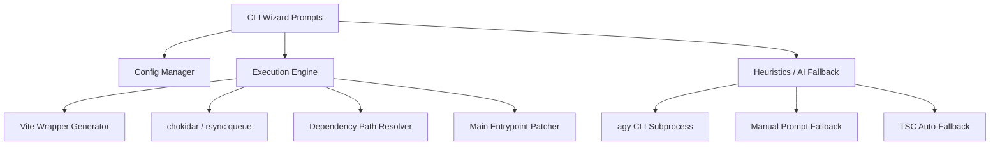

# Implementation Plan: NodePi CLI Wizard (Design & Architecture)

`NodePi` is a CLI Wizard version of [node-package-injector](https://github.com/JR-NodePI/node-package-injector). It is a development tool designed to seamlessly simulate and sync local npm dependencies.

---

## 🏗️ Architecture Design

NodePi transitions from a complex grid-based TUI to a robust sequential CLI Wizard.

### 1. Package-Manager Agnostic Dependency Modes

> **Key Design Decision**: NodePi does **not** invoke any package manager (`pnpm install`, `yarn install`, etc.) in the target project. Instead, it operates by directly overwriting dependency folders inside the existing `node_modules/` hierarchy using `rsync`. This makes NodePi fully compatible with Yarn, npm, pnpm, or any other package manager.
>
> **Rationale**: The original design relied on `pnpm`'s `"injected": true` mechanism, but this only works inside pnpm workspaces. Since 100% of analyzed repositories use Yarn (flat hoisting), running `pnpm install` would destroy the `node_modules` structure and break the target project. Direct `rsync` avoids this entirely.

Both modes operate directly inside the target's real `node_modules` folder:

1. **Injection Mode (Static)**: Locates the dependency folder inside `node_modules/<dep>/`, backs it up, and performs a one-time `rsync` of the local dependency's compiled output into that folder.
   - **Path Resolution**: Checks `node_modules/<dep>/` first (hoisted layout, common in Yarn/npm). If not found, uses `require.resolve('<dep>/package.json', { paths: [targetDir] })` to handle any package manager layout.
2. **Synchronization Mode (Live)**:
   - Uses `chokidar` to watch the source package's compiled output directory.
   - **Debouncing & Concurrency**: Watches source changes with a 150ms debounce and serializes `rsync` executions using a queue system per dependency to avoid system saturation.
   - On change, uses `rsync` to atomically copy the changes into `node_modules/<dep>/` of the target.
   - **Conditional Vite Wrapper**: If Vite is detected in the target project, generates a temporary `vite.config.[ext]` wrapper that imports the user's real Vite config, adding `optimizeDeps.exclude` and un-ignoring the `node_modules` folder. If Vite is absent, this wrapper step is skipped entirely.

### 2. Pre-flight & AI-Driven Script Resolution

Instead of relying on fragile string-matching heuristics or asking the user for build scripts, NodePi delegates 100% of the build-toolchain analysis to AI.

**Preflight Checks**:

1. **Post-Crash Recovery**: Checks for left-over backup metadata in `.nodepi/backup-meta.json`. If found (indicating a previous unclean exit like `kill -9`), offers to restore files before proceeding.
2. **Vite Detection**: Checks for `vite.config.*` to decide whether Vite wrappers are applicable.
3. **Safe Git Guard**: Verifies if the dependency is a Git repository and has a remote upstream before running up-to-date checks, preventing crashes on newly initialized or local-only projects.
4. **System Tools**: Validates that `rsync`, `git`, and optionally `agy` are available.

> **Note**: The PM Collision Check from the original design has been **removed**. Since NodePi no longer runs any package manager in the target project, there is no collision risk. NodePi works transparently with any lockfile.

**AI Inference Fallback**: After the user selects the operation mode (Sync or Inject), the CLI checks its smart caching layer (`~/.nodepi/scripts_cache.json`). The cache generates a SHA-256 hash using the `package.json` and all build configuration files (`tsconfig*.json`, `vite.config.ts`, etc. — note: `tsconfig*.json` with glob, not just `tsconfig.json`). If a cache miss occurs, the CLI bundles all these relevant files and executes a background call to `agy` with a 15-second timeout.

- **Payload Optimization**: The payload data sent to `agy` is simplified to only include `"name"`, `"scripts"`, and dependency keys (omitting full objects and versions) to prevent API size limit and proxy timeouts.

- **On Success**: `agy` returns a standardized JSON object mapping each dependency to its correct `watch`/`build` script and its compiled output directory, which is cached.
- **On Fallback**: If `agy` fails or times out, the CLI prompts the user to select one of the scripts from `package.json` and inputs/selects the output directory (suggesting defaults like `dist`). This selection is cached under the same hash.
- **TSC Watch Auto-Fallback**: If a TypeScript package has no `watch` script, NodePi automatically generates `tsc -w -p ./tsconfig.build.json` (or `tsconfig.json` if no build-specific config exists).
- **Pure JS Packages**: If no compilation is needed, `buildScript: null`, `watchScript: null`, `outDir: "."`. In Sync mode, chokidar watches source files directly.

### 3. Clean-up & Exit Resiliency

To guarantee workspace stability:

- **Backup & Metadata**: Before starting, the CLI backs up the target dependency folders inside `node_modules/` and the Vite config (if applicable), writing metadata to `.nodepi/backup-meta.json`. The target's `package.json` and lockfiles are **never modified**.
- **Entrypoint Patching**: After the initial rsync, if the copied dependency's `package.json` has an empty `"main"` field (common in "publish from subfolder" patterns), NodePi patches the copy in `node_modules/<dep>/package.json` to set `"main": "<outDir>/index.js"`. This patch is tracked in the backup metadata for clean restoration.
- **Restoration**: On exit signals (`SIGINT`, `SIGTERM`), the CLI terminates all child process groups (`process.kill(-pid)`), restores dependency folders and Vite config synchronously from `.nodepi/backups/`, and deletes the `.nodepi/` directory. If the process is killed abruptly, the Preflight recovery step handles restoration on the next startup.

### CLI Modules Architecture

## 🛠️ Implementation Phases

1. **Phase 1: Foundation**: Setup `clack/prompts`, implement system preflight checks (post-crash recovery, Vite detection, tool validation), and global `.nodepirc` parsing.
2. **Phase 2: The Wizard**: Build the interactive prompt flow (Select packages → Multi-Dependency Discovery via `node_modules/` graph traversal → Git Guard [with non-git and no-upstream safe fallbacks] → Select Mode). Also, display the dynamically and programmatically generated target project command sequence, and prompt the user to optionally execute it.
3. **Phase 3: The AI Engine**: Implement the prompt builder for `agy` (invoked via `agy --print "<prompt>" --print-timeout 15s --dangerously-skip-permissions`), parse JSON response, implement TSC watch auto-fallback for TypeScript packages without watch scripts, and implement the interactive manual prompt fallback on failure/timeout.
4. **Phase 4: Execution Engine**: Implement the backup logic (backup dependency folders in `node_modules/`, writing metadata to `.nodepi/backup-meta.json`), dependency path resolution (`require.resolve` fallback), initial `rsync` overwrite, entrypoint patching for `"main": ""` packages, and optional Vite wrapper generator.
5. **Phase 5: Orchestration**: Implement `chokidar` + `rsync` sync loop (with 150ms debounce and sequential queueing), and spawning AI/fallback-discovered compilers.
6. **Phase 6: Exit Handlers**: Ensure bulletproof `SIGINT` trapping to restore the workspace pristinely — restore backed-up folders, remove `.nodepi/`, kill all subprocesses.
