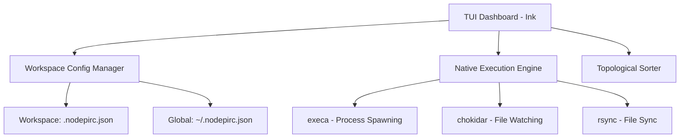

# Implementation Plan: NodePi TUI - `nodepi` (Design & Architecture Plan)

`NodePi TUI` (whose executable binary will be registered as `nodepi`) will be the terminal user interface (TUI) version of [node-package-injector](https://github.com/JR-NodePI/node-package-injector). This document establishes the analysis of the original project, the architecture proposal for the TUI version, and the key alignment decisions.

---

## 🔍 Analysis of `node-package-injector` (Original)

The original project is a desktop application based on **Electron + React + Vite**. Its purpose is to inject and sync local npm dependencies in other packages without using a monorepo setup.

### 1. Key Original Components

- **Package Bunch**: A set defining a _Target Package_ (the main development project) and its _Dependency Packages_ (the local libraries injected into it).
- **Execution Modules**:
  - `BuildService`: Runs compilation scripts for local dependencies and packages them into `.tgz` files (via npm/yarn/pnpm packaging commands).
  - `SyncService`: Configures live synchronization using `rsync` and directory watchers (`watch`). It dynamically modifies Vite/Craco configs (`vite.config.ts`, `craco.config.ts`) using bash/sed to inject path aliases in development.
  - `StartService`: Controls the sequential execution flow: Pre-builds ➡️ Installs ➡️ Builds ➡️ Injection ➡️ Sync Start ➡️ Post-builds.
- **Persistence**: Saves configurations and bunches in the browser's `localStorage` within the Electron view.
- **Command Processing**: Passes shell commands from the renderer process (React) to the main Electron process via IPC (`ipcRenderer`), where they run via `child_process` (with added compatibility layers for WSL on Windows).

---

## 🏗️ Design Proposal for `NodePi TUI`

The TUI version aims to deliver the same capabilities in a lightweight terminal environment, removing Electron's resource footprint and facilitating seamless terminal workflows (like SSH sessions or split terminal panes).

### Comparison: Electron vs TUI

| Feature               | Electron Version (Original)                                              | Proposed TUI Version                                                                                                       |
| :-------------------- | :----------------------------------------------------------------------- | :------------------------------------------------------------------------------------------------------------------------- |
| **Target Context**    | Global bunch configuration (target can be any path, selected in the UI). | **CWD Context**: Target is always the working directory (`process.cwd()`). Launches directly into the project's dashboard. |
| **User Interface**    | HTML/React browser components (`fratch-ui`)                              | React terminal components (`Ink`)                                                                                          |
| **Persistence**       | Electron WebView's `localStorage`                                        | Workspace-local `./.nodepirc.json` and global `~/.nodepirc.json`                                                           |
| **Command Execution** | IPC ➡️ Main Process ➡️ `child_process`                                   | Direct native execution with `execa` (wrapping `child_process`)                                                            |
| **User Input**        | HTML forms and mouse clicks                                              | Keyboard hotkeys and interactive terminal prompts                                                                          |
| **Console Logs**      | Web console accordion groups                                             | Live streaming logs panel with vertical mouse scrolling                                                                    |

### NodePi Dependency Modes

Both modes are unified under the same physical installation folder (`node_modules/<dependency-name>`) by leveraging **`pnpm`** with `"injected": true` in `dependenciesMeta`:

1.  **Injection Mode (Build Mode)**: A static "snapshot" of the build. The local library is compiled, packaged, and installed physically in `node_modules` via `pnpm install`. It is static and does not run sync daemons or config wrappers.
2.  **Synchronization Mode (Sync Mode)**: Built for active development. Syncs local library source file changes in real-time using `rsync watch` directly to `node_modules/<dependency-name>`. The TUI dynamically generates `.vite.config.nodepi.ts` so Vite watches the `node_modules` directory and disables pre-bundling cache, enabling native browser HMR.

### Clean-up, Backup & Exit Resiliency (Instant Exit)

To guarantee workspace stability and prevent leaving corrupted dependencies in `node_modules` when stopping the TUI:

- **Pre-injection Backup**: Before injecting or syncing, the TUI physically backs up:
  1. The original folders in `node_modules/<dependency-name>` (stored in `node_modules/.nodepi-backup/<dependency-name>`).
  2. The target's original `package.json` and `pnpm-lock.yaml` files.
- **Restoration of State (Instant Exit)**: When stopping tasks or closing the TUI, the original `package.json`, `pnpm-lock.yaml`, and `node_modules` subdirectories are immediately restored by copying the backups back. Temporary files (like `.vite.config.nodepi.ts`) are deleted. Because the restore is a simple physical file replacement, **no slow `pnpm install` is executed on exit**, guaranteeing instant TUI shutdown.
- **Exit Signals Handlers**: The TUI intercepts process signals (`SIGINT` on Ctrl+C, `SIGTERM`, `exit`, and uncaught exceptions) to synchronously run the cleanup routine and terminate background watcher and compiler processes (using precise process group kills `process.kill(-pid, 'SIGKILL')`) before terminating.

### Startup Checks & Validations

When launching `nodepi`, a strict three-step validation is executed:

1.  **Step 1: System Dependencies**: Verifies availability of `node`, `rsync`, `git`, and **`pnpm`** in the PATH. File hashing uses Node.js native `crypto` module. File watching uses `chokidar`.
2.  **Step 2: Container Directories**: Validates that at least one base search folder is configured globally (in `~/.nodepirc.json`) and located under the user's home directory (`~/`).
3.  **Step 3: Target Project Validation (CWD)**: Statically verifies that the current folder (`process.cwd()`) contains files for a Node + Vite project (presence of `package.json` and `vite.config.ts` or variants). **No target scripts are executed in this check.**

If any validation step fails, the TUI halts and renders an error screen with corrective instructions.

### TUI Modules Architecture

---

## 🛠️ TUI Layout & Structure

The interface is built with **React + Ink** and structured as follows:

1.  **Header**: Displays title and version: `NodePi v1.0.0` (dynamic, from package.json).
2.  **Main Area (Left)**:
    - **Target Panel**: Displays active target metadata and scripts.
    - **Dependencies Panel**: Local dependency list with cursor navigation and hotkeys (`[t]` toggle status, `[m]` toggle mode, `[x]` remove).
    - **Console Logs**: Real-time interactive logs streaming. This panel supports vertical mouse wheel scrolling.
3.  **Sidebar (Right)**:
    - **Active Processes**: List of all parallel running subprocesses (dev server, rsync syncs, dependency watch compilers) along with their names and PIDs. If none are active, it shows "Idle".
    - **Dependency Timeline**: Vertical, inverted graph representation showing the target package at the top, fed by dependencies from the bottom (`▲ ● lib-b ▲ ● lib-a`) using flow characters (`│`, `▲`).
    - **Container Directories**: Global search paths (formatted as `~/`).
    - **Fixed and static**: The sidebar is fixed and has no scroll.

4.  **Footer**:
    - **Status Bar (Fixed)**: Bottom bar displaying the target CWD (formatted as `~/`) and active Git branch.
    - **Command Bar**: Quick key shortcuts (`[r]` Run, `[f]` Force Run, `[s]` Stop, `[a]` Add Dep, `[c]` Config, `[q]` Quit).

5.  **Layout Adaptability (Inspired by OpenCode)**:
    - **Dimension Checks**: Real-time listener (`process.stdout.on('resize', ...)`) enforcing a minimum size of **80x24**. Smaller terminals pause the Dashboard and show a warning.
    - **Responsive Columns**:
      - At widths `>= 100` columns, displays Main Area (left) and Fixed Sidebar (right) side-by-side.
      - At widths `< 100` columns, collapses/hides the Sidebar to prioritize viewport space for logs and the dependency list.

---

## 💬 Design Decisions Taken

1.  **UI Framework (React + Ink)**: Declarative, component-based layout engine. Uses the **Yoga** Flexbox engine (same as React Native) to simplify grid panels, status bars, and alignment properties.
2.  **Target Environment Support**: Limited exclusively to macOS and Linux native environments (bash and zsh).
3.  **Persistence**: Local target config (`.nodepirc.json`) and global configuration (`~/.nodepirc.json`).
4.  **Validation Checks**: Static CWD validation checking files instead of executing scripts during startup.
5.  **Technology Stack Justification (vs Go/Bubble Tea)**:
    - _Ecosystem Integration_: Built for JS/TS projects. Programing in TS/Node.js removes binary boundaries, making it direct and simple to read configs, import Node tools, and coordinate Vite processes.
    - _React State Hooks_: Simplifies modular component lifecycles (`useState`, `useEffect`) and nested component rendering.
6.  **Real-Time Graph Resolution**: Graph calculation runs instantly when selecting a dependency via `[a]`. It immediately updates the target's `.nodepirc.json` and active TUI state.
7.  **Smart Script Engine**:
    - _Smart Installs_: Skip `pnpm install` if `node_modules` exists and `package.json` hash matches cache.
    - _Smart Builds_: Skip dependency compilations if output exists and source code files have not changed.
    - _Force Run (`[f]`)_: Reset caches and force clean rebuilds and installs.
8.  **Vite Cache Busting**: Delete `node_modules/.vite` prior to dev server start to bypass Vite's pre-bundling caches.
9.  **No-install Exit**: Backup `package.json` and `pnpm-lock.yaml` in addition to `node_modules/<dep>`, letting the exit routine perform physical restoration to avoid slow post-exit `pnpm install` steps.
10. **Dependency Watch Compilers (Sync Mode)**: Run the dependency's watch script in the background so that TypeScript compiles on change, feeding `rsync` automatically.
11. **Precise Process Group Termination (NodePi-2 Strategy)**: To prevent terminating unrelated Node, Vite, or npm processes on the user's operating system, the TUI does not use wildcard process name killing. Instead, it tracks the PID of every spawned child process (spawning them as group leaders with `{ detached: true }`) and kills the entire process group cleanly using `process.kill(-pid, 'SIGKILL')` on stop or exit.
12. **Process Execution Model (Sequential vs Parallel)**: The orchestration workflow is split into synchronous blocking steps (e.g. cleanup, pre-builds, topological builds, installs, cache-busting) and concurrent parallel steps (dev server, watch compilers, sync watchers). Only the parallel processes are dynamically tracked and shown in the sidebar.
13. **AI-Driven Script Selection (Agy) & Role Mappings**: When script configurations are missing in `.nodepirc.json` for a package, the TUI intercepts execution and uses the AI engine (`agy --model gemini-1.5-flash`) to infer the correct scripts from the `package.json`. If Agy fails, it falls back to interactive selectors. It supports two script role groups: **Target Role** (Dev Server and Pre-build scripts) and **Dependency Role** (Build, Watch Compiler, and Clean scripts). Mappings are saved to `.nodepirc.json`.

---

## 🧪 Testing Strategy (TDD)

To guarantee the reliability of the system orchestration, file manipulation, and terminal rendering, the project strictly adheres to **Test-Driven Development (TDD)** using `vitest` and `@inkjs/testing`.

1. **Mandatory TDD Approach**:
   - No implementation code can be written without a failing test first.
   - Every utility function, state slice (Zustand), and React Ink component must have complete test coverage.
2. **Core Logic Unit Tests**:
   - Utilities handling `package.json` mutations, file system interactions, and dependency resolution must be tested in isolation (mocking the `fs` module when necessary).
3. **Execution Engine Integration Tests**:
   - The process manager (`execa` wrapper) and process termination logic (`SIGKILL`) must be tested to ensure no orphan processes remain on different OS environments.
   - Scenarios like dependency injection failures or missing permissions must be covered.
4. **TUI Component Rendering Tests**:
   - UI elements and complex screens (Dashboard, Timeline, Interactive Prompts) will be tested headless using `@inkjs/testing` to verify correct output strings and ANSI behaviors without requiring an actual terminal window.
5. **Environment Restoration**:
   - All tests modifying the file system or environment variables must utilize the `afterEach` hook to revert changes (e.g., restoring original paths or mocks) to ensure hermetic and reproducible test runs.
