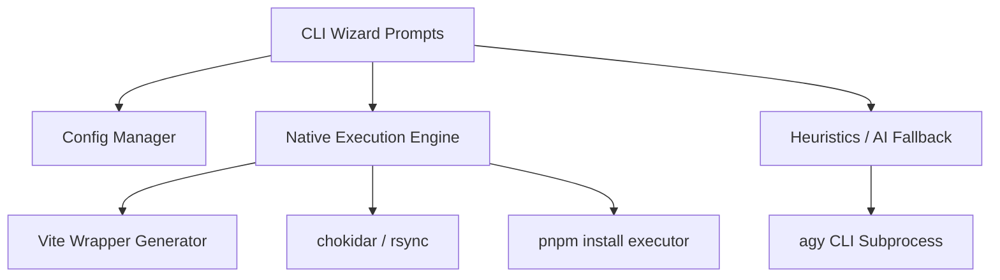

# Implementation Plan: NodePi CLI Wizard (Design & Architecture)

`NodePi` is a CLI Wizard version of [node-package-injector](https://github.com/JR-NodePI/node-package-injector). It is a development tool designed to seamlessly simulate and sync local npm dependencies.

---

## 🏗️ Architecture Design

NodePi transitions from a complex grid-based TUI to a robust sequential CLI Wizard.

### 1. Unified Dependency Modes

Both modes operate directly inside the target's real `node_modules` folder:

1. **Injection Mode (Static)**: Uses `pnpm`'s `"injected": true` mechanism for a fast, one-time physical copy.
2. **Synchronization Mode (Live)**:
   - Uses `chokidar` to watch the source package root (excluding `node_modules` and `.git`).
   - On change, uses `rsync` to atomically copy the changes directly into the target's `node_modules/.pnpm/...` location.
   - Generates a temporary `.nodepi/vite.wrapper.ts` that imports the user's real Vite config, adding `optimizeDeps.exclude` and un-ignoring the `node_modules` folder for `server.watch.ignored`.

### 2. Pre-flight & Heuristics (With AI Fallback)

1. **Fast Path**: Resolving build output directories and scripts relies on parsing `package.json` (`main`, `exports`, `scripts`) and `tsconfig.json` (`outDir`).
2. **AI Fallback**: If a package is extremely legacy or complex, the CLI spawns a background `execa` call to `agy` (Antigravity AI) to dynamically analyze the package and return the correct scripts and paths in JSON format.

### 3. Clean-up & Exit Resiliency

To guarantee workspace stability:

- **Backup**: Before starting, the CLI backs up `package.json`, `pnpm-lock.yaml`, and the target's original `node_modules/<dep>` folders.
- **Restoration**: On `Ctrl+C` (`SIGINT`), the CLI intercepts the exit, safely terminates all child process groups (`process.kill(-pid)`), and physically copies the backups back. No `pnpm install` is required on exit.

### CLI Modules Architecture

## 🛠️ Implementation Phases

1. **Phase 1: Foundation**: Setup `clack/prompts`, implement system preflight checks, and global/local `.nodepirc` parsing.
2. **Phase 2: The Wizard**: Build the interactive prompt flow (Select packages -> Select Modes -> Select Scripts).
3. **Phase 3: The Engine**: Implement the backup/restore logic, `pnpm` injection modification, and the `.nodepi/vite.wrapper.ts` generator.
4. **Phase 4: Orchestration**: Implement `chokidar` + `rsync` sync loop, background compiler spawning, and Vite dev server launching.
5. **Phase 5: Exit Handlers**: Ensure bulletproof `SIGINT` trapping to leave the workspace pristine.
