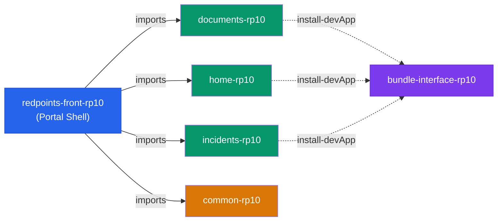

# Analysis: Should NodePi detect `redpoints-front-rp10`?

## 1. `pnpm dev` Output

The command failed with exit code 1:

```
[ERR_PNPM_FETCH_404] GET https://registry.npmjs.org/redpoints-front-translations: Not Found - 404
```

> [!WARNING] `pnpm install` (automatically run by `pnpm dev` when detecting missing dependencies) attempts to download RedPoints' private packages (`redpoints-front-translations`, and presumably many other `redpoints-*` packages) from the public npm registry, where they do not exist. This project requires a **private corporate registry** (`nexus.rdpnts.com`) configured in a local `.npmrc` or an existing `yarn.lock` already resolved using Yarn.

---

## 2. Project Structure

| Signal                                     | Present | File / Evidence                                                                                                              |
| :----------------------------------------- | :-----: | :--------------------------------------------------------------------------------------------------------------------------- |
| `vite.config.js`                           |   ✅    | [vite.config.js](file:///Users/jorge/projects/frontend-repos/redpoints-front-rp10/vite.config.js)                            |
| `vite` in devDependencies                  |   ✅    | `"vite": "4.1.0"` in [package.json L124](file:///Users/jorge/projects/frontend-repos/redpoints-front-rp10/package.json#L124) |
| `@vitejs/plugin-react-swc`                 |   ✅    | [package.json L96](file:///Users/jorge/projects/frontend-repos/redpoints-front-rp10/package.json#L96)                        |
| `index.html` with `<script type="module">` |   ✅    | [index.html](file:///Users/jorge/projects/frontend-repos/redpoints-front-rp10/index.html)                                    |
| Script `start` uses `vite`                 |   ✅    | `"start": "yarn conf && HTTPS=true vite --open ..."`                                                                         |
| Script `build` uses `vite build`           |   ✅    | `"build": "NODE_OPTIONS=... vite build"`                                                                                     |
| `yarn.lock`                                |   ✅    | 380 KB                                                                                                                       |
| `package-lock.json` / `pnpm-lock.yaml`     |   ❌    | Yarn only                                                                                                                    |

---

## 3. Verdict: Should it be detected by NodePi?

### **YES, absolutely.** This is a native Vite project.

Vite detection in [preflight.ts](file:///Users/jorge/projects/NodePi-tui/src/core/preflight.ts#L102-L120) searches for `vite.config.{ts,js,mjs,cjs,mts}` files in the root directory. `redpoints-front-rp10` contains a [vite.config.js](file:///Users/jorge/projects/frontend-repos/redpoints-front-rp10/vite.config.js) and therefore will be **correctly detected as a Vite project** by the current Preflight check.

---

## 4. Key Differences with Isolated Modules (e.g. `documents-rp10`)

This project is **fundamentally different** from the isolated modules analyzed earlier:

| Feature               | `redpoints-front-rp10` (Portal Shell)                       | `redpoints-front-documents-rp10` (Isolated Module)             |
| :-------------------- | :---------------------------------------------------------- | :------------------------------------------------------------- |
| **Role**              | Main application (Portal)                                   | Isolated sub-module (plugin)                                   |
| **`private`**         | `true` — Not published to npm                               | `false` (via `"publishConfig"`) — Published as a package       |
| **`vite.config`**     | Native, own config, committed in Git                        | Dynamically injected by `install-devApp`, in `.gitignore`      |
| **RP10 Dependencies** | Imports **all** isolated modules as production dependencies | Only imports itself (self-referencing via aliases)             |
| **`install-devApp`**  | NOT used — self-sufficient                                  | Used — requires the `bundle-interface` shell                   |
| **`yarn dist`**       | NOT present — compiles with `vite build` for deployment     | Present — compiles modular bundles with `vite-build-bundle.js` |
| **Redux Actions**     | Uses actions from all imported modules                      | Declares its own with prefixes (e.g. `DOCUMENTS_REPOSITORY@`)  |

### Relationship Diagram:



---

## 5. Implications for NodePi

### What works correctly today:

- ✅ **Vite Detection**: `preflight.ts` detects it correctly.
- ✅ **Vite HMR Wrapper**: [execution.ts](file:///Users/jorge/projects/NodePi-tui/src/core/execution.ts#L82-L131) can inject the HMR wrapper to force hot reloading of local dependencies inside `node_modules`.

### Special Portal Shell Considerations:

1. **Many potential local dependencies**: This project imports ~12 `redpoints-front-*-rp10` modules. If the developer has several of these cloned locally, NodePi will need to discover and synchronize **many** intermediate dependencies simultaneously.
2. **Does not use `install-devApp`**: The Vite configuration is its own, not injected. NodePi does not need to worry about configuration file conflicts from `bundle-interface`.
3. **Yarn-only**: The project uses `yarn.lock` exclusively. The lockfile collision warning in Preflight will always trigger when attempting to run `pnpm install`.
4. **Private Registry**: The `pnpm install` step will fail if the corporate registry is not pre-configured (as seen in the command error).
